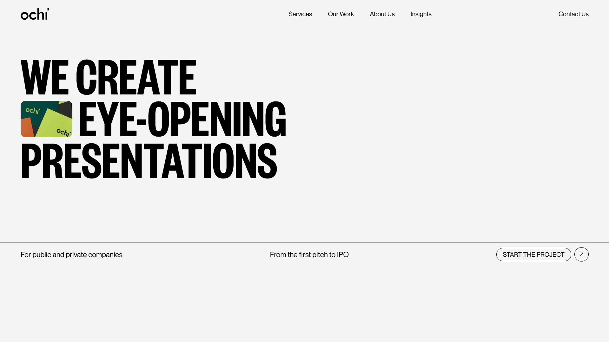

# 🎨 Ochi Design Agency Website Clone

This is a modern, interactive single-page portfolio website inspired by the design aesthetics of top creative agencies like Obys (referenced by the Ochi project). Built with React, Framer Motion, Tailwind CSS, and Locomotive Scroll, the site showcases smooth scrolling, creative animations, and bold visual storytelling — perfect for a design agency or portfolio showcase.

[](https://its-riki-dev.github.io/ochi-design-clone/)

---

## 💡 Highlights

- 🎯 Smooth scrolling with Locomotive Scroll
- 👁️‍🗨️ Animated eyes that track mouse movement
- 🎞️ Hover animations on project cards (text rise, image zoom)
- 💥 Animated buttons with dot expansion and arrow reveals
- 🎬 Framer Motion transitions across all interactive elements
- 🖼️ Parallax sections with layered scroll speeds
- 🔤 Infinite marquee text for visual storytelling
- 🧼 Clean layout, bold typography

---

## 🧠 Learnings & Concepts Covered

- Creating scroll-based animations and parallax layouts
- Building reusable animated components in React
- Applying motion effects with Framer Motion
- Cursor tracking and event-based animation logic
- Tailwind CSS for responsive and utility-driven design
- DOM manipulation through external libraries like Locomotive Scroll
- Improving UX with interactive UI elements (e.g. animated buttons, marquee)
---

## 🛠️ Built With

- [React](https://reactjs.org/)
- [Framer Motion](https://motion.dev/)
- [TailwindCSS](https://tailwindcss.com/)
- [React Icons](https://react-icons.github.io/react-icons/)

---

## 📌 Future Improvements

- ✅ Add dark mode toggle
- ✅ Introduce CMS or content API for dynamic project content
- ✅ Add smooth page transitions (for potential multi-page expansion)
- ✅ Integrate lazy loading and performance optimizations
- ✅ Create custom cursor with hover interactions
- ✅ Add accessibility improvements (ARIA, focus states)
- ✅ Implement scroll progress indicators or scroll-triggered animations
- ✅ Make it responsive for all devices

---

## Clone the repo

```bash
git clone https://github.com/its-riki-dev/ochi-design-clone.git

# Navigate into the project
cd mini-docs-app

# Install dependencies
npm install

# Start the development server
npm run dev

# Build for production
npm run build

# Preview production build
npm run preview
```

---

## 🙌 Credits

Inspired by the Ochi project from [Obys Agency](https://obys.agency/)

---

## 📄 License

- This project is licensed under the MIT License.
